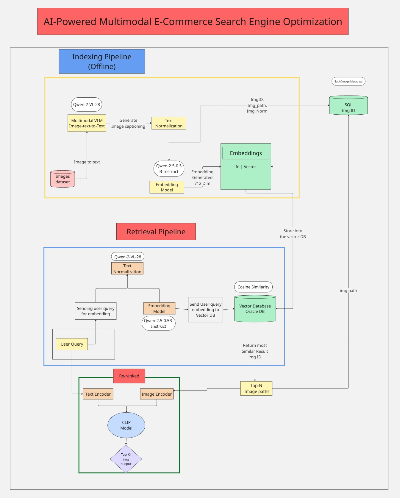
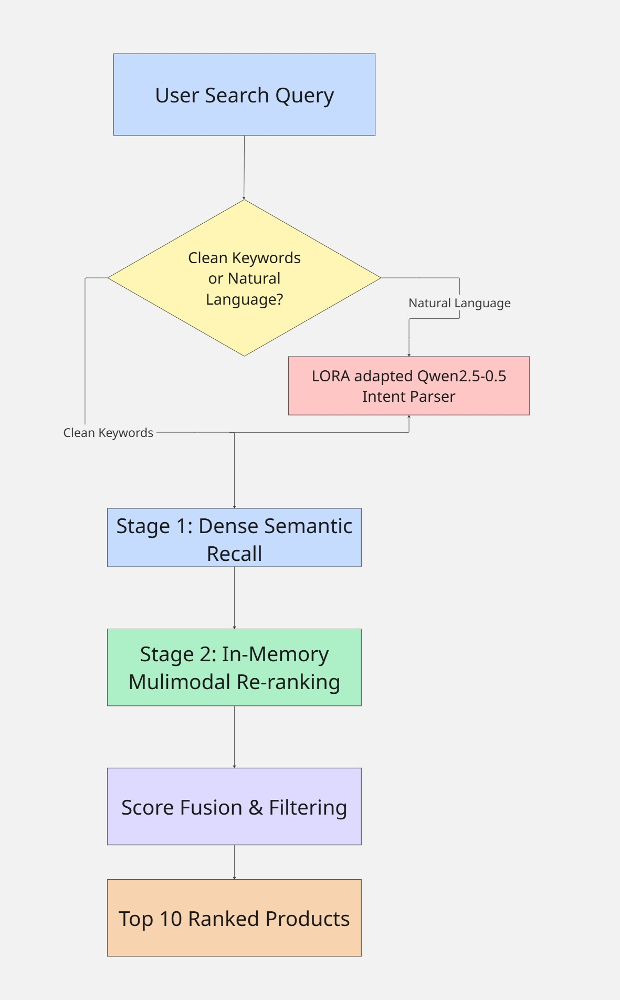

# AI-Powered Multimodal E-Commerce Search Engine

An AI-powered **multimodal e-commerce search system** that enables users to discover products using **natural-language queries and images**. The system combines **Qwen models, multimodal embeddings, FAISS vector search, and SQLite** to provide intelligent and context-aware product retrieval.

## 🚀 Key Features

***Natural Language Search** — Understands conversational product queries using Qwen models.
***Image-Based Search** — Retrieves visually relevant products from uploaded images.
***Multimodal AI** — Combines textual and visual information for richer product discovery.
***Semantic Retrieval** — Uses FAISS for efficient similarity-based vector search.
***Product Metadata Management** — Stores structured product information using SQLite.
***Relevance-Based Ranking** — Ranks retrieved products based on semantic similarity and query relevance.
***Web Application** — Interactive frontend with a FastAPI-powered backend.

---

## 🏗️ System Architecture

The system follows a multimodal retrieval pipeline where user queries are processed by AI models, converted into meaningful representations, and matched against the product catalog.



---

## 🔄 User Workflow

1. **User Input**

   * Enter a natural-language product query
   * OR upload a product image

2. **Query Understanding**

   * Qwen models analyze the user's intent and input.
   * Relevant attributes and semantic information are extracted.

3. **Embedding Generation**

   * Text/image inputs are converted into vector representations.

4. **Vector Retrieval**

   * FAISS performs similarity search against the product embedding index.

5. **Metadata Retrieval**

   * Matching product information is retrieved from SQLite.

6. **Ranking & Results**

   * Products are ranked according to relevance.
   * The most relevant products are displayed to the user.



---

## 🧠 AI Pipeline

```text
User Query / Image
        ↓
   Qwen Model
        ↓
Query Understanding
        ↓
Multimodal Embedding
        ↓
   FAISS Search
        ↓
Similarity Matching
        ↓
   SQLite Metadata
        ↓
Relevance Ranking
        ↓
   Product Results
```

---

## 🛠️ Technology Stack

| Component            | Technology                 |
| -------------------- | -------------------------- |
| AI / LLM             | Qwen                       |
| Programming          | Python                     |
| Vector Search        | FAISS                      |
| Database             | SQLite                     |
| Backend              | FastAPI                    |
| Frontend             | React.js                   |
| AI / Data Processing | NLP, Multimodal Embeddings |

---

## 💡 Problem Statement

Traditional e-commerce search often relies heavily on exact keywords, making it difficult for users to find products when they:

* describe products conversationally,
* use incomplete or ambiguous queries,
* search using an image instead of product names,
* or combine multiple product attributes in a single query.

This project addresses these limitations through **AI-powered multimodal semantic search**.

---

## 🎯 Objective

The primary objective is to build an intelligent product discovery system that can understand **what the user means**, rather than relying only on exact keyword matching.

The system aims to:

* Improve product discoverability
* Support multimodal search
* Reduce dependency on exact keywords
* Provide semantically relevant results
* Create a scalable foundation for AI-driven e-commerce search

---

## 📁 Project Structure

```text
multimodal-ecommerce-search/
│
├── backend/
│   ├── api/
│   ├── models/
│   ├── services/
│   └── main.py
│
├── frontend/
│   └── ...
│
├── data/
│   ├── products.db
│   └── embeddings/
│
├── models/
│   └── ...
│
├── architecture.png
├── workflow.png
├── requirements.txt
└── README.md
```

---

## ⚙️ Installation

### 1. Clone the repository

```bash
git clone https://github.com/your-username/multimodal-ecommerce-search.git
cd multimodal-ecommerce-search
```

### 2. Install dependencies

```bash
pip install -r requirements.txt
```

### 3. Start the backend

```bash
uvicorn backend.main:app --reload
```

### 4. Start the frontend

```bash
npm install
npm run dev
```

---

## 📈 Future Scope

* Hybrid keyword + semantic retrieval
* Personalized product recommendations
* Conversational shopping assistant
* Query expansion and refinement using LLMs
* Search analytics and relevance monitoring
* Automated product catalog enrichment
* Deployment using cloud infrastructure

---

## 👩‍💻 Author

**Sania Golhar**

B.Tech — Artificial Intelligence & Data Science

GitHub: [sania-2912](https://github.com/sania-2912)
